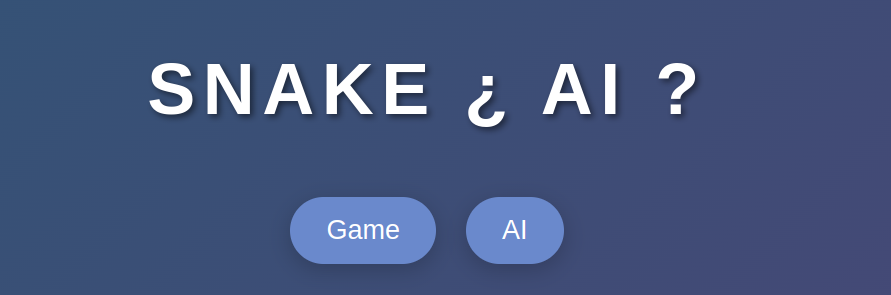
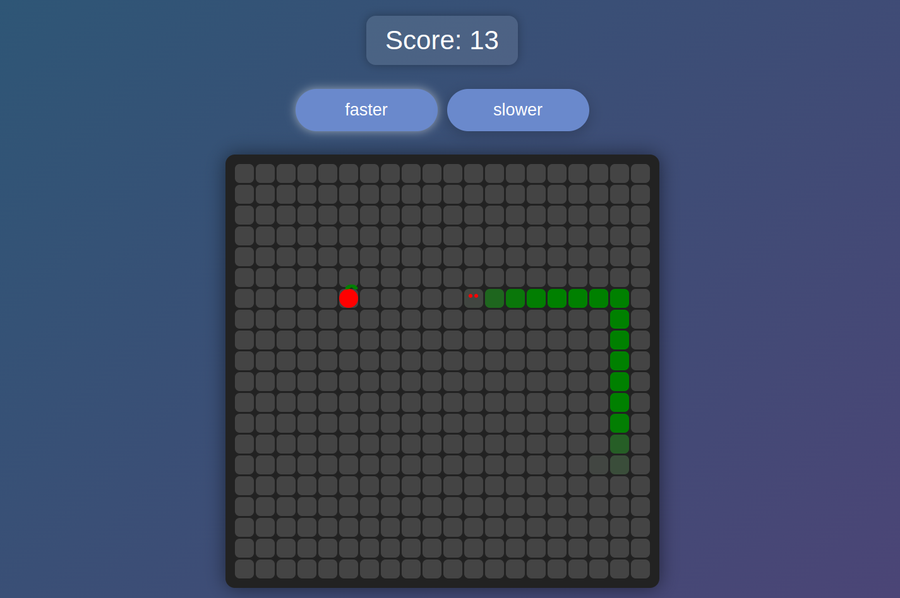

## Game

Play the classic Snake game everyone knows and loves.

## AI

In addition to playing the game yourself, you can also watch an AI try (heavy on the trying part) to solve the game. The AI uses a Hamiltonian Cycle-based algorithm to navigate the grid safely while attempting to collect apples efficiently.

### How the AI works:
The AI follows a two-step process for making decisions:
1. **Shortcut Move**: The AI first checks for the shortest safe path to the apple using legal moves. If a move is safe and leads closer to the apple, the AI takes it.
2. **Fallback Move**: If no shortcut is available, the AI reverts to following a Hamiltonian Cycle, ensuring that it covers the entire grid  ~~without trapping itself~~ . This guarantees a ~~safe~~ path even when there are no immediate shortcuts to the apple.

### Breadth-First Search (BFS):

The AI also uses a BFS (Breadth-First Search) algorithm to determine if there is enough space on the grid for the snake to move safely after making a particular move. The BFS checks the available positions around the snake's head and calculates whether there is enough open space for the snake to continue moving ~~without getting trapped~~.

This combination of BFS, Hamiltonian Cycle, and shortcut logic helps the AI efficiently collect apples and avoid collisions (it doesn't yet).

## [Visist the Website here]()

## Contributing

The current AI algorithm is far from perfect and has room for improvement. Any help or contributions to improve the AI or the overall project would be greatly appreciated!
`